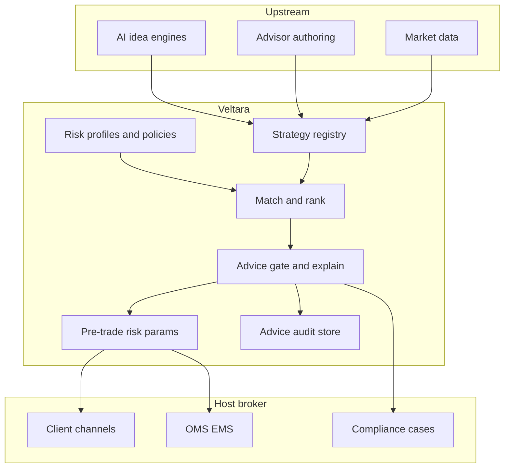

# Veltara

**Source:** `ai-in-financial/AITrading_WP_EN/`
**Domain:** `ai-fin`
**One-liner:** A suitability-gated AI wealth-advice and strategy marketplace that lets retail brokers and wealth platforms deliver human-plus-machine investment recommendations without transferring conduct risk to opaque copytrading feeds.
**Wedge:** Regulated retail brokers and digital wealth platforms (EU/UK/MENA) that already offer ideas, copytrading, or robo sleeves and need advice governance, risk-profile matching, and auditable human-in-the-loop before execution.
**Positioning:** Advice-governance infrastructure for ai-assisted wealth, not another signal feed. The source shows institutions capture AI alpha while retail faces information asymmetry; Veltara’s job is to make hybrid AI+advisor recommendations suitable, explainable, and executable under firm policy—distinct from Autara’s cross-provider bill/debt self-driving agent.

## Market research synthesis

### Thesis from source

The AITrading whitepaper argues that financial markets remain dominated by banks, hedge funds, and institutional market makers who enjoy growing information asymmetry versus tens of millions of ordinary traders. Daily FX volume alone exceeds five trillion dollars, yet the infrastructure that produced Medallion’s ~70% annualized returns and Eurekahedge’s finding that 17 ai-managed funds returned 91% versus 40% for human-managed funds (2011–2018) is unavailable to retail. The paper’s mission statement is explicit: make high-quality ai-assisted wealth management accessible to everyone by combining an AI idea engine, professional trading advisors, and transparent marketplace contracts.

The commercially useful insight is not “democratize Medallion.” It is the hybrid loop the paper describes: AI scans millions of data points 24/7 and proposes trade ideas tailored to experience and risk profile; human advisors reinterpret and package those ideas; the retail user selects a risk/reward-matched strategy and executes with built-in risk controls. The authors claim proprietary factors have produced roughly 2× S&P 500 return at similar risk, with strategy Sharpe near 2 versus ~0.5 for the index. They also note that standalone idea subscriptions typically charge two- to three-figure monthly fees for a handful of human-only ideas—an expensive, non-integrated status quo.

What the market still lacks—and what this product ships—is the governance layer that turns that loop into regulated advice: documented suitability against a risk profile, explanation of why a strategy was offered, advisor accountability, pre-execution risk parameters (goal probability, drawdown bounds, hedging suggestions), and an audit trail when AI and human diverge. Without that layer, “AI wealth for everyone” is just ungoverned solicitation.

### Buyer & economic model

- **Primary buyer:** Head of Wealth / Head of Digital Investing or Chief Compliance Officer at a retail broker or neo-wealth platform.
- **Users:** advice supervisors and compliance officers (daily gates), portfolio/strategy curators, licensed advisors on the marketplace, risk officers, retail end clients (via host UI).
- **Budget owner / value metric:** wealth P&L and conduct-risk budget. Value metric is advice throughput under suitability (strategies approved per advisor-hour) and reduction in unsuitable recommendation incidents versus unmanaged copytrading.
- **Competing status quo:** unmanaged signal Telegram channels and copytrading mirrors; standalone idea newsletters; black-box robo sleeves with weak explanation; advisor platforms that neither bind AI suggestions to risk profiles nor record human override rationale.

### Domain constraints

- **Regulatory / trust / safety:** investment advice and portfolio management often require licensing; the source itself notes licensed activities must run via partners. Suitability, best-interest / COBS-style rules, marketing of past performance, and clear ai-versus-human attribution are non-negotiable.
- **Data sensitivity:** client risk profiles, holdings, and execution intent are highly sensitive; marketplace counterparties must not see other clients’ books.
- **Change-management realities:** brokers will not rip out OMS/EMS; Veltara sits as a pre-trade advice and strategy-certification plane that emits approved order intents to existing brokers.

## Business requirements

- BR-1: Every recommendation presented to a client must be matched to a recorded risk/reward profile and either pass suitability rules or be blocked with a documented reason.
- BR-2: Each strategy or idea must declare whether its origin is ai-generated, human-authored, or hybrid, and retain the version of the model or advisor package that produced it.
- BR-3: Clients must receive an explanation at the level of thesis, key factors, historical risk statistics (including Sharpe/drawdown where claimed), and why the item fits their profile—opaque “trust the AI” is not acceptable.
- BR-4: Licensed advisors must be able to approve, edit, or reject AI drafts before client visibility when firm policy requires human sign-off.
- BR-5: Pre-execution risk parameters (max loss, target probability, hedge suggestions) must be attached to approved strategies and enforced or explicitly overridden with dual control.
- BR-6: Copytrading and marketplace purchases must create an auditable contract record of fees, success terms, and advice scope, suitable for dispute and conduct review.
- BR-7: Past performance marketing must be labelled and constrained by firm policy; the platform must refuse to present unverifiable return claims as certified.
- BR-8: Firms must export a period advice log tying client, profile, recommendation, gate outcome, and execution intent for regulator or internal audit.
- BR-9: Model and advisor ranking used for personalization must be explainable to supervisors (why this client saw these three strategies).
- BR-10: Kill-switch and freeze controls must allow compliance to suspend a strategy, advisor, or model version firm-wide within minutes without waiting for engineering.
- BR-11: Commercial take-rates and subscription tiers for marketplace advice must be disclosed to the host firm; Veltara does not bury fees inside opaque spreads.
- BR-12: The product must operate as advice governance infrastructure for the host broker—not as an unlicensed broker—routing execution through the firm’s licensed venues.

## User stories

Canonical user stories live in sibling [USER_STORIES.md](USER_STORIES.md).

## System design

### Overview

Veltara sits between idea/model engines (or third-party signal providers), licensed advisors, and the host broker’s client channels. It maintains client risk profiles and firm suitability policies; scores and ranks candidate strategies; requires human gates where configured; attaches explanations and risk parameters; and emits approved recommendation events plus optional order intents to the broker’s execution stack. Marketplace commercial terms and advice provenance are retained as the conduct system of record.

### Actors & boundaries

- **Actors:** retail client, licensed advisor, advice supervisor, compliance, risk officer, host broker operator, model/strategy provider.
- **Trust boundary:** client PII and holdings stay in the host broker’s domain; Veltara stores profiles, advice artifacts, and gate decisions under the broker’s tenancy. External model providers receive only pseudonymous feature vectors or public market data—not full client books.
- **Human-in-the-loop points:** advisor publish approval; compliance freeze; dual-control suitability override; model version promotion.

### Core capabilities

1. **Client risk profiling and suitability policy** — profiles, hard constraints, firm rule packs.
2. **Strategy and idea registry** — AI/human/hybrid provenance, versions, performance claims with evidence status.
3. **Matching and ranking** — profile-aware recommendation shortlists with supervisor-visible reasons.
4. **Advice gating and explanation** — approve/edit/reject with narrative explanations to clients.
5. **Pre-trade risk parameters** — loss bounds, hedges, concentration checks before execution intent.
6. **Marketplace contracts** — fee terms, copytrading scopes, dispute hooks.
7. **Freeze and kill-switch** — strategy/advisor/model suspension.
8. **Advice audit export** — regulator-ready logs and period packs.

### Conceptual data

- **Primary entities:** ClientProfile, SuitabilityPolicy, StrategyPackage, ModelVersion, Advisor, Recommendation, GateDecision, RiskParameterSet, MarketplaceContract, FreezeOrder, AdviceAuditExport.
- **Critical events:** profile updated, strategy submitted, recommendation generated, gate passed/failed, advisor edited, freeze issued, execution intent emitted, audit exported.
- **Retention / audit needs:** advice and gate decisions retained for the full local advice-record statutory window; performance evidence retained with claim status; personal data subject to host retention and deletion policies.

### Integrations (conceptual)

- **Systems of record:** broker CRM/KYC, account and holdings, OMS/EMS, billing.
- **Upstream signals:** quant/AI idea engines, market data, news/fundamental feeds, advisor authoring tools.
- **Downstream actions:** client app recommendation cards, order tickets, compliance case systems, regulatory report packs.

### High-level architecture

### Success metrics

- **Leading:** share of recommendations that pass suitability on first presentation; median time advisor spends reviewing AI drafts; freeze mean-time-to-activate; explanation open rate.
- **Lagging:** unsuitable-advice incident rate versus baseline copytrading; advice-related complaint rate; regulated audit findings related to AI advice; wealth AUM or traded notional under governed strategies.

## OpenAPI skeleton

Canonical HTTP surface lives in sibling [openapi.yaml](openapi.yaml). Summary:

- **Base path:** `/v1/...`
- **Auth:** `X-API-Key` for broker system integration; Bearer JWT for operators and advisors.
- **Resource groups:** Profiles, Strategies, Recommendations, Gates, Marketplace, Freezes, Audit.
