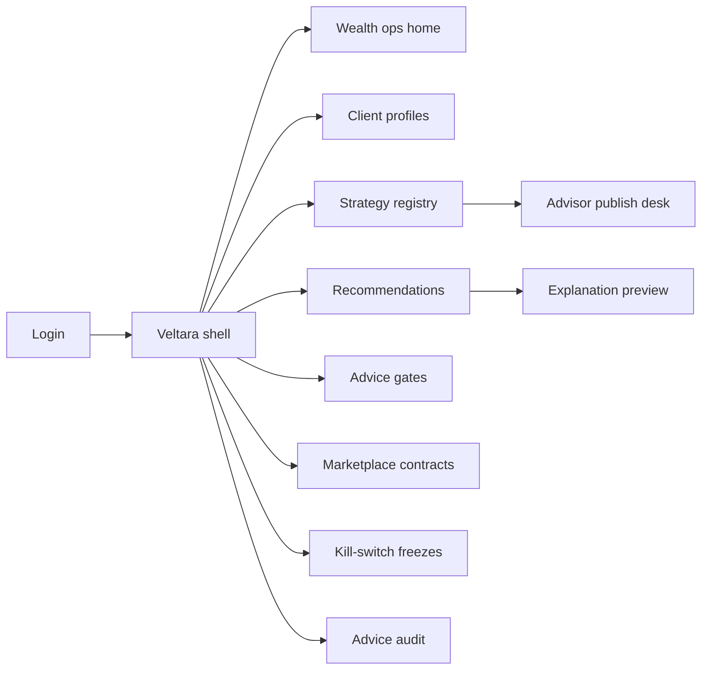
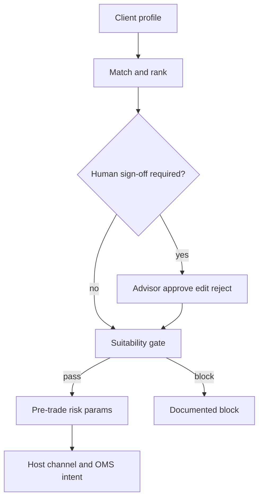

# Veltara — Web app

**Product:** [PRODUCT.md](./PRODUCT.md)
**Primary surface:** Advice-governance console (suitability gates + advisor marketplace under one Veltara shell for the host broker)
**Secondary surfaces:** Client explanation preview (read-only host-embed mirror); marketplace contract viewer (read-only dispute)
**Design thesis:** Veltara is a suitability chamber for hybrid AI+advisor wealth ideas—not a signal Telegram, not a trading blotter, and not a credit or fraud desk. The metaphor is a private banking parlour with a glass compliance wall: deep forest ground, champagne gold for profile-matched passes, frost blue for ai-origin labels, and crimson freeze bars that drop in minutes. Every strategy carries a provenance plaque (AI / human / hybrid); past performance claims wear evidence seals or stay veiled. The Veltara wordmark is champagne gold on every gated recommendation so conduct risk never looks like “just another idea feed.”

## UX research synthesis

### Category peers (best-in-class)

- **Wealthfront / Betterment advice disclosure UX:** Risk-profile matching and plain-language “why this portfolio.” Steal: profile-fit explanations (BR-3); reject black-box robo with weak suitability audit.
- **Interactive Brokers / retail OMS pre-trade risk:** Hard loss limits and order intent checks. Steal: pre-execution risk parameters that block enthusiasm clicks (BR-5); reject ungoverned copytrading mirrors.
- **eToro / copytrading (as anti-pattern + selective steal):** Marketplace following with social proof. Steal: contract records of fees/scope (BR-6); reject unmanaged suitability and opaque AI attribution.
- **AdvisorEngine / Orion compliance overlays:** Advisor sign-off before client visibility. Steal: human approve/edit/reject of AI drafts (BR-4); firm-wide freeze MTTR in minutes (BR-10).

### Patterns to adopt / reject

- **Adopt:** Suitability pass/block as primary object; AI/human/hybrid provenance; advisor gate; pre-trade risk params; marketplace contracts; kill-switch freezes; advice audit export; disclosed take-rates.
- **Reject:** Signal-feed home; fraud case queues; credit decision seals; “trust the AI” cards; unverifiable return claims as certified; Veltara-as-broker execution UI.

### Trust, density, and workflow constraints from PRODUCT.md

Licensed activities run via host partners—Veltara is advice governance, not an unlicensed broker (BR-12). Marketplace counterparties must not see other clients’ books. Compliance needs freeze without engineering tickets. Past performance marketing constrained (BR-7).

## Information architecture

### Nav model

### Roles → default home

| Role | Default home | Why |
|------|--------------|-----|
| Head of digital wealth | Wealth ops home | Governed vs copytrading comparison |
| Licensed advisor | Advisor publish desk | AI draft review (BR-4) |
| Compliance / advice supervisor | Advice gates + freezes | Suitability and kill-switch (BR-1, BR-10) |
| Risk officer | Strategy risk stats + concentration | Stale Sharpe and herd risk |
| Platform admin | Advisor onboarding + model retire | License attestations |
| Retail client | Host app only (preview mirror) | Not operator console |

### Cross-links to OpenAPI resources

| Nav area | OpenAPI tags / resources |
|----------|---------------------------|
| Risk profiles | Profiles |
| Ideas / packages | Strategies |
| Profile-matched shortlists | Recommendations |
| Suitability approve/block | Gates |
| Fees / copytrading scope | Marketplace |
| Strategy/advisor/model suspend | Freezes |
| Regulator period logs | Audit |

## Screen inventory

### Wealth ops home

- **Purpose:** Compare governed AI advice throughput vs unmanaged copytrading risk in one composition.
- **Entry:** Head of digital wealth default.
- **Layout regions:** Brand; suitability pass rate; unsuitable incident trend; freeze MTTR; conversion under governed strategies; alerts for concentration and stale claims.
- **Primary actions:** Open gates backlog; open freezes; export period comparison.
- **Empty / loading / error:** Empty = connect profiles + first strategy; error = broker sync id.
- **BR / story ties:** Head of wealth stories; BR-1.

### Client risk profile

- **Purpose:** Record risk/reward profile and hard constraints used by suitability.
- **Entry:** From CRM sync; supervisor drill.
- **Layout regions:** Profile bands; hard loss limits; product permissions; last suitability policy version.
- **Primary actions:** Update profile; lock constraints; view matching reasons.
- **Empty / loading / error:** Missing profile blocks all recommendations (BR-1).
- **BR / story ties:** BR-1.

### Strategy registry

- **Purpose:** Register strategies with AI/human/hybrid provenance and evidence-status performance claims.
- **Entry:** Curators; advisors; model providers (bounded).
- **Layout regions:** Registry table; provenance plaque; claim evidence seal/veil; model/advisor version; concentration followers.
- **Primary actions:** Submit strategy; retire version; attach evidence; refuse unverifiable certify (BR-7).
- **Empty / loading / error:** Unverified claim cannot show as certified.
- **BR / story ties:** BR-2, BR-7.

### Advisor publish desk

- **Purpose:** Review AI drafts, edit thesis/risk bounds, publish under advisor name.
- **Entry:** Licensed advisor default.
- **Layout regions:** Draft queue; thesis editor; risk param set; suitability rejection feedback; publish under license attestation.
- **Primary actions:** Approve; edit; reject; see gate rejects for packaging fix.
- **Empty / loading / error:** No license attestation = publish disabled.
- **BR / story ties:** BR-4; advisor stories.

### Recommendation shortlist

- **Purpose:** Profile-aware ranking with supervisor-visible “why these three.”
- **Entry:** From client context; wealth ops.
- **Layout regions:** Ranked strategies; match reasons; origin labels; blocked-with-reason list.
- **Primary actions:** Open gate; preview client explanation; dual-control near-miss override request.
- **Empty / loading / error:** All blocked = clear policy reasons (BR-1, BR-9).
- **BR / story ties:** BR-1, BR-9.

### Advice gate and explanation

- **Purpose:** Pass/block suitability; client-grade explanation (thesis, factors, risk stats, fit).
- **Entry:** Shortlist; advisor publish path.
- **Layout regions:** Gate decision; explanation panes; Sharpe/drawdown with evidence status; profile fit narrative; dual-control override slot.
- **Primary actions:** Pass; block with reason; override with dual control; emit to host channel.
- **Empty / loading / error:** Opaque explanation incomplete = cannot pass (BR-3).
- **BR / story ties:** BR-3, BR-4.

### Pre-trade risk parameters

- **Purpose:** Max loss, target probability, hedges—enforced or dual-control override before execution intent.
- **Entry:** After gate pass; client hard limits merge.
- **Layout regions:** Param set; client hard-limit overlay; hedge suggestions; override dual control; OMS intent preview.
- **Primary actions:** Attach params; enforce; override; emit order intent to host OMS.
- **Empty / loading / error:** Missing params block intent (BR-5).
- **BR / story ties:** BR-5; client hard-limit story.

### Marketplace contracts

- **Purpose:** Auditable fees, success terms, advice scope for copytrading/purchases.
- **Entry:** Marketplace nav; dispute.
- **Layout regions:** Contract record; disclosed take-rate; scope; dispute hooks; client/strategy ids.
- **Primary actions:** Open contract; export for conduct review; freeze linked strategy.
- **Empty / loading / error:** Undisclosed fee = cannot activate (BR-6, BR-11).
- **BR / story ties:** BR-6, BR-11.

### Kill-switch freezes

- **Purpose:** Suspend strategy, advisor, or model firm-wide within minutes.
- **Entry:** Compliance default shortcut; risk alert.
- **Layout regions:** Freeze targets; blast radius (clients following); activate confirm; audit stamp; unfreeze dual control.
- **Primary actions:** Freeze now; notify host channels; schedule review.
- **Empty / loading / error:** Activation failure pages on-call (BR-10).
- **BR / story ties:** BR-10; compliance stories.

### Concentration and stale-claim monitors

- **Purpose:** Herd following limits and recalculated risk stats so stale Sharpe cannot persist as live advice.
- **Entry:** Risk officer default.
- **Layout regions:** Aggregate following charts; claim recalculation schedule; stale veil triggers.
- **Primary actions:** Alert; force veil; recommend freeze.
- **Empty / loading / error:** Overdue recalc = frost warning.
- **BR / story ties:** Risk officer stories; BR-7.

### Advice audit export

- **Purpose:** Period log: client, profile, recommendation, gate, execution intent.
- **Entry:** Compliance/audit.
- **Layout regions:** Period picker; client lookup; pack preview; integrity hash.
- **Primary actions:** Export; sample for regulator.
- **Empty / loading / error:** Missing gate linkage listed (BR-8).
- **BR / story ties:** BR-8.

## Key flows

1. **Governed recommendation** — profile → match strategies → advisor gate if required → suitability explain → risk params → host visibility; failure: block with reason.

2. **Compliance freeze** — toxic strategy detected → freeze firm-wide → channels stop serving → audit stamp (BR-10).

3. **Marketplace copy follow** — contract with disclosed fees → suitability still applied → risk params enforce hard loss (BR-6, BR-5).

4. **Near-miss override** — advisor insists → dual-control supervisor → rare evidenced exception.

5. **Period conduct export** — select window → advice log pack for regulator (BR-8).

## Design system

### Tokens (CSS variables)

- `--color-ink: #E8EEE6` — text on forest
- `--color-forest-950: #0B1410` — app ground
- `--color-forest-900: #132019` — panels
- `--color-champagne: #C6A75E` — suitability pass / brand
- `--color-frost-ai: #7EB6D6` — ai-origin labels
- `--color-human: #A3B18A` — human-authored
- `--color-hybrid: #9B8AA6` — hybrid (muted, not purple glow)
- `--color-freeze: #C1121F` — kill-switch
- `--color-veil: #6C757D` — unverified performance
- `--font-display: "Cormorant Garamond", serif` — parlour titles
- `--font-body: "IBM Plex Sans", sans-serif`
- `--font-mono: "IBM Plex Mono", monospace` — strategy ids, contract ids
- `--space-1`…`--space-8`: 4px scale
- `--radius-sm: 4px`; `--radius-md: 8px`
- `--motion-pass: 180ms ease-out` — champagne gate pass
- `--motion-freeze: 160ms ease-in` — crimson bar drop
- `--motion-veil: 240ms ease-in-out` — claim veil
- Atmosphere: soft wood-grain vignette on forest; glass-wall hairlines; no neon trading arcade; no purple fintech gradients.

### Typography & brand

- Cormorant for strategy titles and explanations; Plex for queues; mono for ids.
- Champagne wordmark on gated surfaces; login headline (“Suitable advice. Not opaque feeds.”).

### Do / don’t

- **Do:** Show provenance plaques; veil unverifiable returns; freeze in one action; disclose marketplace take-rates; route execution to host OMS only.
- **Don’t:** Signal-spam home; “trust the AI”; clone fraud/credit UIs; bury fees; act as the broker of record in UI copy.

### Accessibility & domain trust cues

- Gate/freeze states text+icon; live regions for freezes; explanation readability; focus: profile → match → gate → risk → intent.

## Component patterns

- **ProvenancePlaque** — AI / human / hybrid + version.
- **SuitabilityGateCard** — pass/block with reason.
- **ClientExplainPanel** — thesis, factors, fit, what can go wrong.
- **RiskParamSet** — max loss, probability, hedges.
- **MarketplaceContractRow** — fees, scope, dispute hook.
- **FreezeBar** — firm-wide suspend with blast radius.
- **ClaimEvidenceSeal** — certified vs veiled performance.
- **AdviceAuditPack** — period regulator export.

## Out of scope for v1 web

- Unlicensed brokerage; OMS replacement; crypto wallet; Telegram signal bots; institutional prop-trading desk; headset trading; Autara-style bill/debt agent.
